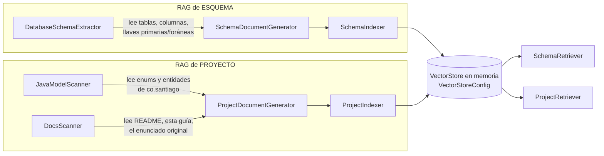
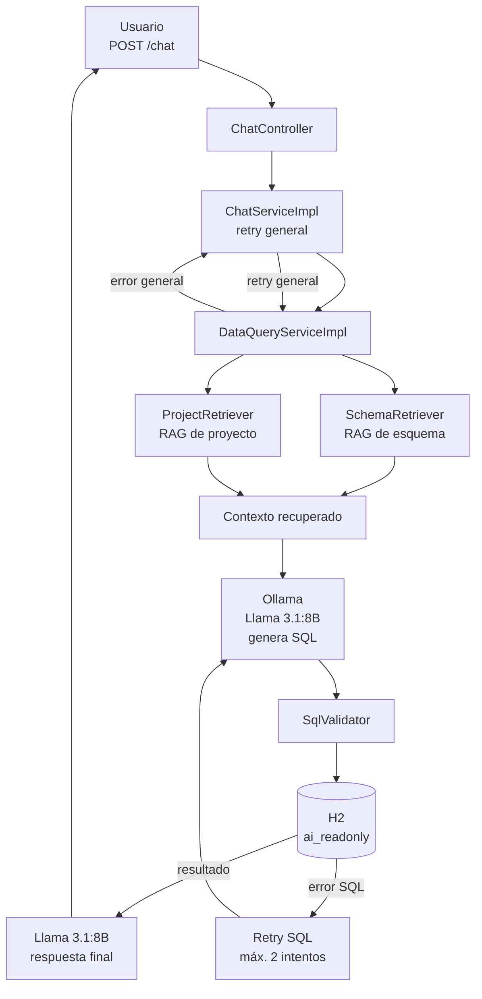

# Chatbot de negocio (RAG + Text-to-SQL + Orquestación determinista)

Le puedes preguntar en español normal cosas del negocio (facturas, pagos,
productos, auditoría) y responde con datos reales de la base de datos —
nunca inventados —, corriendo 100% en tu computadora, sin mandar nada a
internet.

Ejemplo:

```
POST /chat
{ "pregunta": "cuanto se ha pagado de la factura 3" }
```

Está construido con tres piezas que se combinan:

| Pieza | En una frase |
|---|---|
| **RAG** (Retrieval-Augmented Generation) | Antes de responder, busca información real (de tu base de datos y de tu código) y se la da al modelo como contexto. |
| **Text-to-SQL** | El modelo convierte tu pregunta en una consulta `SELECT` y la ejecuta contra la base de datos. |
| **Orquestación determinista** | El backend controla el flujo: recupera contexto, genera SQL, valida, ejecuta y reintenta si es necesario. El modelo se concentra en generar SQL y redactar la respuesta. |

El resto de este documento explica cada una con el detalle de qué
archivo hace qué.

---

## 1. Instalación

### Paso 1 — Instalar Ollama

Ollama es el programa que corre el "cerebro" (modelo de lenguaje) en tu
propia máquina.

Descárgalo de [ollama.com](https://ollama.com) e instálalo. Verifica:

```bash
ollama --version
```

Por defecto expone su API en `http://localhost:11434`.

### Paso 2 — Descargar los modelos que usa el proyecto

El proyecto necesita dos modelos:

```bash
# El que "piensa" y responde
ollama pull llama3.1:8b

# El que convierte texto en vectores para la búsqueda semántica
ollama pull nomic-embed-text
```

Verifica que quedaron:

```bash
ollama list
```

### Paso 3 — Verificar el modelo de chat (opcional)

```bash
ollama run llama3.1: 8b
```

Si responde en la terminal, quedó bien conectado.

### Paso 4 — Levantar el proyecto

```bash
mvn spring-boot:run
```

Al arrancar vas a ver en el log que indexa el esquema de la base de datos
y el conocimiento del proyecto (sección 2). Eso pasa **cada vez que
arrancas la app** — no queda nada guardado de una corrida a otra, a
propósito: así siempre respondes con la base de datos y el código tal
como están en ese momento, sin datos viejos colgados.

No se necesita ningún contenedor de Docker para el chatbot. (Si ves
Docker corriendo en tu máquina para este proyecto, es por MinIO — el
almacenamiento de imágenes de productos —, algo aparte que no tiene que
ver con el chatbot.)

---

## 2. RAG — de dónde saca el conocimiento

RAG quiere decir, en corto: "antes de responder, busca información
relevante y dásela al modelo como contexto" — en vez de esperar que el
modelo ya se sepa de memoria los datos de tu negocio (que nunca los va a
saber, porque son tuyos).

Hay **dos** fuentes separadas de conocimiento, cada una indexada por su
cuenta, guardadas en el mismo buscador en memoria:



- **RAG de esquema**: lee directamente la base de datos (tablas,
  columnas, llaves) y arma un texto por tabla. `SchemaRetriever` además
  expande automáticamente por llave foránea: si preguntas por "pagos",
  también trae `INVOICE` aunque no la hayas nombrado, porque `PAYMENT`
  la referencia.
- **RAG de proyecto**: lee tu propio código — los `enum` (¿qué estados
  puede tener una factura?) y las entidades (¿qué campos tiene un
  `Payment`?) — más la documentación en Markdown del repo. Esto es lo
  que le permite al chatbot entender vocabulario de negocio, no solo
  nombres de tabla.

Las dos cosas se reconstruyen **completas, desde cero, en cada
arranque** de la aplicación — no queda ningún archivo ni base de datos
externa guardando esto entre una corrida y otra.

**Dónde vive en el código:**

| Archivo | Qué hace |
|---|---|
| `VectorStoreConfig.java` | Crea el buscador semántico en memoria — la pieza de la que dependen los cuatro renglones de abajo. |
| `DatabaseSchemaExtractor.java` | Lee la estructura real de la base de datos (tablas, columnas, llaves). |
| `SchemaDocumentGenerator.java` | Convierte esa estructura en texto legible para indexar. |
| `SchemaRelationExpander.java` | Agrega automáticamente las tablas relacionadas por llave foránea. |
| `SchemaIndexer.java` | Indexa el esquema completo en cada arranque. |
| `SchemaRetriever.java` | Busca qué tablas son relevantes para una pregunta. |
| `ColumnMetadata.java` / `TableMetadata.java` / `ForeignKeyMetadata.java` | Estructuras simples que guardan la info de una columna/tabla/llave mientras se procesa. |
| `CodeUnit.java` | Estructura simple que guarda la info de un enum o entidad leída del código. |
| `JavaModelScanner.java` | Lee tus enums y entidades (`.java`) para sacar sus campos/valores posibles. |
| `DocsScanner.java` | Lee la documentación en Markdown del proyecto. |
| `ProjectDocumentGenerator.java` | Convierte enums/entidades/docs en texto indexable, partiendo los documentos largos en pedazos. |
| `ProjectIndexer.java` | Indexa el conocimiento del proyecto en cada arranque. |
| `ProjectRetriever.java` | Busca qué conocimiento de negocio es relevante para una pregunta. |

---

## 3. Text-to-SQL — de la pregunta al `SELECT`

Esta parte convierte la pregunta del usuario en una consulta SQL real. En la
versión actual el modelo **no decide autónomamente qué herramienta llamar**.
El flujo está orquestado por `DataQueryServiceImpl`, lo que hace el
comportamiento más predecible y evita que el modelo omita pasos importantes.

El proceso es:

1. `SchemaRetriever` recupera las tablas y columnas relevantes.
2. `ProjectRetriever` recupera conocimiento de negocio relacionado.
3. Llama 3.1:8B recibe ambos contextos y genera exclusivamente SQL.
4. `SqlValidator` valida que la consulta sea de solo lectura.
5. `DatabaseQueryService` ejecuta el `SELECT` con el usuario `ai_readonly`.
6. Si el SQL falla, `DataQueryServiceImpl` entrega al modelo el SQL anterior y
   el error real para que genere una consulta corregida.
7. Con el resultado real de la base de datos, el modelo genera una respuesta
   breve en español.

**Dónde vive en el código:**

| Archivo | Qué hace |
|---|---|
| `DataQueryServiceImpl.java` | Orquesta RAG de esquema, RAG de proyecto, generación SQL, validación, ejecución, reintento SQL y respuesta final. |
| `DataQueryService.java` | Contrato del servicio de consultas de datos. |
| `SqlValidator.java` | Revisa que el SQL sea de solo lectura (`SELECT`/`WITH`) y bloquea instrucciones peligrosas. |
| `DatabaseQueryService.java` / `DatabaseQueryServiceImpl.java` | Ejecuta el SQL ya validado contra la base de datos. |
| `AiDatabaseConfig.java` | Configura la conexión de solo lectura y los límites de consulta. |
| `AiReadOnlyUserInitializer.java` | Crea al arrancar el usuario `ai_readonly`, con permisos únicamente de lectura. |
| `ChatServiceImpl.java` | Recibe la pregunta y ejecuta el flujo completo mediante `DataQueryService`; además aplica reintentos generales ante fallos transitorios. |

---|---|
| `ChatServiceImpl.java` | Le da al modelo, en el mensaje de sistema, las reglas de qué SQL puede escribir (solo `SELECT`, usar las tablas del esquema, etc.). |
| `ChatTools.executeReadOnlyQuery` (dentro de `ChatTools.java`) | Recibe el SQL que escribió el modelo y lo manda a ejecutar. Si falla, devuelve el error para que el modelo lo corrija y reintente. |
| `SqlValidator.java` | Antes de ejecutar, revisa que el texto sea de verdad un `SELECT`/`WITH`, sin comentarios ni instrucciones peligrosas. |
| `DatabaseQueryService.java` / `DatabaseQueryServiceImpl.java` | Ejecuta la consulta ya validada contra la base de datos. |
| `AiDatabaseConfig.java` | Define la conexión que se usa para ejecutar ese SQL: de solo lectura, máximo 100 filas, máximo 5 segundos. |
| `AiReadOnlyUserInitializer.java` | Crea, al arrancar, el usuario de base de datos `ai_readonly` con permiso de solo `SELECT`. |

Ver la sección 5 para el detalle de por qué esto es seguro aunque el
modelo se equivoque.

---

## 4. Orquestación determinista y reintentos

La implementación inicial utilizaba **Tool Calling autónomo**, donde el modelo
decidía cuándo buscar el esquema, consultar conocimiento del proyecto y ejecutar
SQL. Esa estrategia se reemplazó por un flujo determinista porque los modelos
locales podían omitir herramientas, inventar resultados o detenerse antes de
ejecutar la consulta.

La arquitectura actual es:



### Dos niveles de reintento

El sistema tiene dos mecanismos distintos:

- **Retry SQL (`DataQueryServiceImpl`)**: hasta 2 intentos. Si una consulta
  generada falla, el segundo intento recibe el SQL anterior, el error real de
  la base de datos, el esquema recuperado y el conocimiento del proyecto.
- **Retry general (`ChatServiceImpl`)**: vuelve a ejecutar el flujo completo
  cuando ocurre una excepción que impide terminar la solicitud. Esto ayuda con
  fallos ocasionales del modelo local o del proceso de inferencia.

Los logs permiten ver cuánto tarda cada etapa, por ejemplo:

```text
[data:schema] ...
[data:project] ...
[data:sql-attempt] ...
[data:sql-generated] ...
[data:sql-validation] ...
[data:sql-execution] ...
[data:answer] ...
[data:end] ...
```

Esto permite distinguir si una demora está en el RAG, en la generación del SQL,
en H2 o en la generación de la respuesta final.

**Dónde vive en el código:**

| Archivo | Qué hace |
|---|---|
| `ChatServiceImpl.java` | Entrada del servicio de chat y reintento general del flujo. |
| `DataQueryServiceImpl.java` | Orquestación principal y reintento de generación/ejecución SQL. |
| `SchemaRetriever.java` | Recupera dinámicamente el esquema relevante; usa un `topK` limitado para no enviar toda la base al modelo. |
| `ProjectRetriever.java` | Recupera reglas, entidades, enums y contexto de negocio relevante. |
| `ChatController.java` | Expone `POST /chat`. |
| `ChatRequestDTO.java` / `ChatResponseDTO.java` | DTO de entrada y salida. |

---|---|
| `ChatTools.java` | Define las tres herramientas (`searchDatabaseSchema`, `searchProjectKnowledge`, `executeReadOnlyQuery`) que el modelo puede invocar. |
| `ChatServiceImpl.java` | Le pasa esas herramientas al modelo y deja que decida cómo combinarlas; también cachea la respuesta. |
| `ChatService.java` | Contrato/interfaz de lo anterior. |
| `ChatController.java` | El endpoint `POST /chat` por donde entra tu pregunta. |
| `ChatRequestDTO.java` / `ChatResponseDTO.java` | Forma de la pregunta que entra y la respuesta que sale. |
| `CacheConfig.java` | Habilita que las respuestas repetidas se guarden en memoria. |

---

## 5. Seguridad de las consultas SQL

Como el modelo escribe SQL por su cuenta, hay varias capas para que
nunca pueda hacer daño, aunque se equivoque:

1. **Solo lectura, a nivel de código**: `SqlValidator` revisa el texto
   de la consulta antes de ejecutarla — solo deja pasar `SELECT`/`WITH`,
   bloquea `INSERT`/`UPDATE`/`DELETE`/`DROP`/etc., bloquea comentarios
   SQL y bloquea que se manden varias consultas pegadas.
2. **Solo lectura, a nivel de base de datos**: existe un usuario de base
   de datos aparte (`ai_readonly`) que **solo tiene permiso de
   `SELECT`** sobre las tablas. El chatbot ejecuta todo a través de ese
   usuario, nunca del usuario administrador que usa el resto de la app.
   Así, aunque el paso anterior fallara por algún motivo, la base de
   datos misma rechazaría cualquier intento de borrar o modificar algo.
3. **Límites de la consulta**: máximo 100 filas de resultado y máximo 5
   segundos de espera por consulta, para que nunca se cuelgue ni traiga
   una cantidad absurda de datos.

---

## 6. Configuración (`application.properties`)

```properties
# Dónde está Ollama corriendo
spring.ai.ollama.base-url=http://localhost:11434

# Qué modelo "piensa" las respuestas
spring.ai.ollama.chat.options.model=llama3.1:8b

# Qué modelo convierte texto en vectores para la búsqueda
spring.ai.ollama.embedding.options.model=nomic-embed-text

# Usuario de solo lectura para las consultas SQL generadas por el chatbot
ai.datasource.username=ai_readonly
ai.datasource.password=ai_readonly_2026

# Límites de seguridad de esas consultas
ai.sql.max-rows=100
ai.sql.query-timeout-seconds=5
```

**Sobre el modelo (`spring.ai.ollama.chat.options.model`)**: actualmente
el proyecto usa **Llama 3.1:8B** como modelo de chat y generación de SQL.
`nomic-embed-text` se mantiene como modelo de embeddings para las búsquedas
semánticas del RAG. Ambos se ejecutan localmente mediante Ollama, por lo que
el tiempo de respuesta depende directamente del hardware disponible.

---

## 7. Metodología: cómo se construyó, por fases

El chatbot se armó en fases, cada una construyendo sobre la anterior:

1. **RAG de esquema** — el chatbot aprende a describir tus tablas y a
   expandir automáticamente por llave foránea.
2. **SQL seguro** — validación de que solo se ejecuten `SELECT`, usuario
   de base de datos de solo lectura, límites de filas y de tiempo.
3. **RAG de proyecto** — el chatbot aprende el vocabulario de negocio:
   qué significan los estados, qué campos tiene cada entidad.
4. **Orquestación determinista** — se reemplaza el agente autónomo por un
   flujo controlado desde `DataQueryServiceImpl`: recuperar esquema y
   conocimiento, generar SQL, validar, ejecutar y reintentar cuando sea
   necesario.

Se probó además una fase de "producción" (guardar el conocimiento en una
base de datos externa para no reconstruirlo en cada arranque, medir qué
tan seguido se usa, limitar cuántas preguntas por minuto) pero se
descartó a propósito: la idea de este proyecto es que sea simple y que
cada arranque parta de cero, sin nada persistido de una corrida a otra.

---

## 8. Preguntas frecuentes

**¿Necesito internet para que funcione?** No. Todo corre local: Ollama,
la base de datos y la aplicación.

**¿Se pierde el conocimiento del chatbot si reinicio la app?** Sí, a
propósito — se reconstruye completo en cada arranque desde tu base de
datos y tu código actuales.

**¿Puede el chatbot borrar o modificar datos?** No. Solo puede leer
(ver sección 5).

**¿Por qué a veces tarda tanto?** Porque el modelo corre en tu propia
máquina, sin usar ningún servidor externo — el tiempo de respuesta
depende directamente de qué tan potente sea tu computadora.