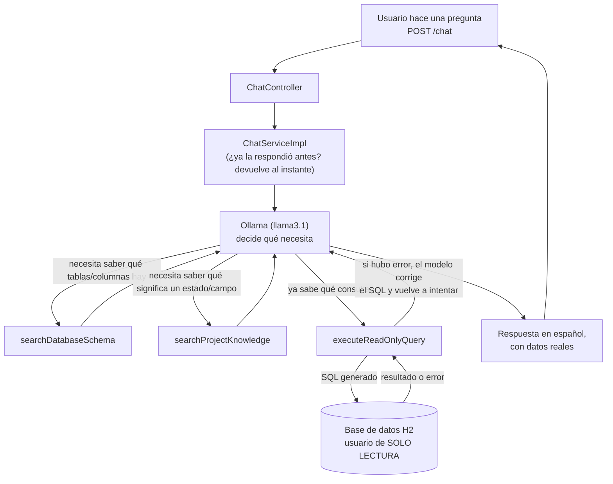
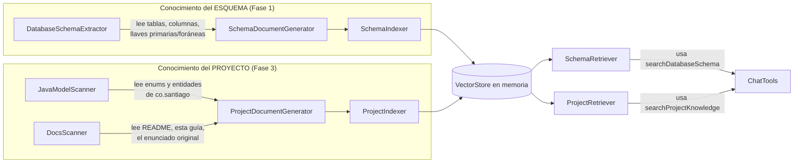

# Chatbot de negocio (RAG + Tool Calling + Text-to-SQL)

Le puedes preguntar en español normal cosas del negocio (facturas, pagos,
productos, auditoría) y responde con datos reales de la base de datos —
nunca inventados —, corriendo 100% en tu computadora, sin mandar nada a
internet.

Ejemplo:

```
POST /chat
{ "pregunta": "cuanto se ha pagado de la factura 3" }
```

---

## 1. Instalación

### Paso 1 — Instalar Ollama

Ollama es el programa que corre el "cerebro" (modelo de lenguaje) en tu
propia máquina.

Descárgalo de [ollama.com](https://ollama.com) e instálalo. Verifica:

```bash
ollama --version
```

Por defecto expone su API en `http://localhost:11434`.

### Paso 2 — Descargar los modelos que usa el proyecto

El proyecto necesita dos modelos:

```bash
# El que "piensa" y responde
ollama pull llama3.1

# El que convierte texto en vectores para la búsqueda semántica
ollama pull nomic-embed-text
```

Verifica que quedaron:

```bash
ollama list
```

### Paso 3 — Verificar el modelo de chat (opcional)

```bash
ollama run llama3.1
```

Si responde en la terminal, quedó bien conectado.

### Paso 4 — Levantar el proyecto

```bash
mvn spring-boot:run
```

Al arrancar vas a ver en el log que indexa el esquema de la base de datos
y el conocimiento del proyecto (ver sección 3). Eso pasa **cada vez que
arrancas la app** — no queda nada guardado de una corrida a otra, a
propósito: así siempre respondes con la base de datos y el código tal
como están en ese momento, sin datos viejos colgados.

No se necesita ningún contenedor de Docker para el chatbot. (Si ves
Docker corriendo en tu máquina para este proyecto, es por MinIO — el
almacenamiento de imágenes de productos —, algo aparte que no tiene que
ver con el chatbot.)

---

## 2. Cómo funciona, en general

En vez de que el código le diga paso a paso al modelo "primero haz esto,
luego esto otro", le entregamos al modelo **tres herramientas** y dejamos
que él mismo decida cuáles usar y en qué orden para responder tu
pregunta. Esto se llama **tool calling** (o "agente"): el modelo puede
"llamar" funciones de Java mientras piensa la respuesta.



Puntos clave de esa imagen:

- El modelo puede usar una herramienta, mirar el resultado, y decidir
  usar otra — o la misma de nuevo con una consulta corregida — antes de
  contestarte. Nosotros no lo forzamos a seguir un orden fijo.
- Si `executeReadOnlyQuery` falla (por ejemplo, el modelo escribió mal
  el nombre de una tabla), el modelo ve el mensaje de error y por su
  cuenta reintenta con una consulta corregida.
- Si le preguntas exactamente lo mismo dos veces, la segunda vez la
  respuesta sale al instante (queda guardada en memoria mientras la app
  esté prendida; se olvida al reiniciar).

---

## 3. Las dos fuentes de conocimiento (RAG)

RAG quiere decir, en corto: "antes de responder, busca información
relevante y dásela al modelo como contexto" — en vez de esperar que el
modelo ya se sepa de memoria los datos de tu negocio (que nunca los va a
saber, porque son tuyos).

Acá hay **dos** fuentes separadas de conocimiento, cada una indexada por
su cuenta:



- **Esquema**: lee directamente la base de datos (tablas, columnas,
  llaves) y arma un texto por tabla. `SchemaRetriever` además expande
  automáticamente por llave foránea: si preguntas por "pagos", también
  trae `INVOICE` aunque no la hayas nombrado, porque `PAYMENT` la
  referencia.
- **Proyecto**: lee tu propio código — los `enum` (¿qué estados puede
  tener una factura?) y las entidades (¿qué campos tiene un `Payment`?)
  — más la documentación en Markdown del repo. Esto es lo que le permite
  al chatbot entender vocabulario de negocio, no solo nombres de tabla.

Las dos cosas se reconstruyen **completas, desde cero, en cada arranque**
de la aplicación — no queda ningún archivo ni base de datos externa
guardando esto entre una corrida y otra.

---

## 4. Seguridad de las consultas SQL

Como el modelo escribe SQL por su cuenta, hay varias capas para que
nunca pueda hacer daño, aunque se equivoque:

1. **Solo lectura, a nivel de código**: `SqlValidator` revisa el texto
   de la consulta antes de ejecutarla — solo deja pasar `SELECT`/`WITH`,
   bloquea `INSERT`/`UPDATE`/`DELETE`/`DROP`/etc., bloquea comentarios
   SQL y bloquea que se manden varias consultas pegadas.
2. **Solo lectura, a nivel de base de datos**: existe un usuario de base
   de datos aparte (`ai_readonly`) que **solo tiene permiso de
   `SELECT`** sobre las tablas. El chatbot ejecuta todo a través de ese
   usuario, nunca del usuario administrador que usa el resto de la app.
   Así, aunque el paso anterior fallara por algún motivo, la base de
   datos misma rechazaría cualquier intento de borrar o modificar algo.
3. **Límites de la consulta**: máximo 100 filas de resultado y máximo 5
   segundos de espera por consulta, para que nunca se cuelgue ni traiga
   una cantidad absurda de datos.

---

## 5. Configuración (`application.properties`)

```properties
# Dónde está Ollama corriendo
spring.ai.ollama.base-url=http://localhost:11434

# Qué modelo "piensa" las respuestas
spring.ai.ollama.chat.options.model=llama3.1

# Qué modelo convierte texto en vectores para la búsqueda
spring.ai.ollama.embedding.options.model=nomic-embed-text

# Usuario de solo lectura para las consultas SQL generadas por el chatbot
ai.datasource.username=ai_readonly
ai.datasource.password=ai_readonly_2026

# Límites de seguridad de esas consultas
ai.sql.max-rows=100
ai.sql.query-timeout-seconds=5
```

**Sobre el modelo (`spring.ai.ollama.chat.options.model`)**: el proyecto
está pensado para correr en una máquina más potente (por ejemplo, un Mac
reciente), donde un modelo grande responde rápido y con más precisión.
En una PC sin tarjeta gráfica dedicada, un modelo grande puede tardar
1-2 minutos por respuesta. Si necesitas probar rápido en una máquina
más limitada, puedes cambiar esta línea a un modelo más chico (por
ejemplo `llama3.2`) — responde en segundos, a cambio de equivocarse un
poco más seguido en preguntas complejas.

---

## 6. Metodología: cómo se construyó, por fases

El chatbot se armó en fases, cada una construyendo sobre la anterior:

1. **Esquema (RAG sobre la base de datos)** — el chatbot aprende a
   describir tus tablas y a expandir automáticamente por llave foránea.
2. **SQL seguro** — validación de que solo se ejecuten `SELECT`, usuario
   de base de datos de solo lectura, límites de filas y de tiempo.
3. **Proyecto (RAG sobre tu código y documentación)** — el chatbot
   aprende el vocabulario de negocio: qué significan los estados, qué
   campos tiene cada entidad.
4. **Agente con herramientas (tool calling)** — en vez de un flujo fijo
   escrito a mano, se le dan las tres herramientas al modelo y él decide
   solo cómo combinarlas para responder, incluyendo corregirse a sí
   mismo si algo falla.

Se probó además una fase de "producción" (guardar el conocimiento en una
base de datos externa para no reconstruirlo en cada arranque, medir qué
tan seguido se usa, limitar cuántas preguntas por minuto) pero se
descartó a propósito: la idea de este proyecto es que sea simple y que
cada arranque parta de cero, sin nada persistido de una corrida a otra.

---

## 7. Preguntas frecuentes

**¿Necesito internet para que funcione?** No. Todo corre local: Ollama,
la base de datos y la aplicación.

**¿Se pierde el conocimiento del chatbot si reinicio la app?** Sí, a
propósito — se reconstruye completo en cada arranque desde tu base de
datos y tu código actuales.

**¿Puede el chatbot borrar o modificar datos?** No. Solo puede leer
(ver sección 4).

**¿Por qué a veces tarda tanto?** Porque el modelo corre en tu propia
máquina, sin usar ningún servidor externo — el tiempo de respuesta
depende directamente de qué tan potente sea tu computadora.


Base de conocimiento (RAG)

┌──────────────────────────────────────────────────────┬──────────────────────────────────────────────────────────────────────────────────────┐
│                       Archivo                        │                                       Función                                        │
├──────────────────────────────────────────────────────┼──────────────────────────────────────────────────────────────────────────────────────┤
│ VectorStoreConfig.java                               │ Crea el "buscador semántico" en memoria — la pieza central de la que dependen todos  │
│                                                      │ los demás.                                                                           │
├──────────────────────────────────────────────────────┼──────────────────────────────────────────────────────────────────────────────────────┤
│ DatabaseSchemaExtractor.java                         │ Lee la estructura real de tu base de datos (tablas, columnas, llaves).               │
├──────────────────────────────────────────────────────┼──────────────────────────────────────────────────────────────────────────────────────┤
│ SchemaDocumentGenerator.java                         │ Convierte esa estructura en texto legible para indexar.                              │
├──────────────────────────────────────────────────────┼──────────────────────────────────────────────────────────────────────────────────────┤
│ SchemaRelationExpander.java                          │ Si preguntas por "pagos", agrega automáticamente las tablas relacionadas (ej.        │
│                                                      │ INVOICE) aunque no las hayas nombrado.                                               │
├──────────────────────────────────────────────────────┼──────────────────────────────────────────────────────────────────────────────────────┤
│ SchemaIndexer.java                                   │ Indexa el esquema completo cada vez que arranca la app.                              │
├──────────────────────────────────────────────────────┼──────────────────────────────────────────────────────────────────────────────────────┤
│ SchemaRetriever.java                                 │ Busca, entre lo indexado, qué tablas son relevantes para tu pregunta.                │
├──────────────────────────────────────────────────────┼──────────────────────────────────────────────────────────────────────────────────────┤
│ ColumnMetadata.java, TableMetadata.java,             │ Estructuras simples que guardan la info de una columna/tabla/llave foránea mientras  │
│ ForeignKeyMetadata.java                              │ se procesa.                                                                          │
├──────────────────────────────────────────────────────┼──────────────────────────────────────────────────────────────────────────────────────┤
│ CodeUnit.java                                        │ Estructura simple que guarda la info de un enum o entidad leída del código.          │
├──────────────────────────────────────────────────────┼──────────────────────────────────────────────────────────────────────────────────────┤
│ JavaModelScanner.java                                │ Lee tus enums y entidades (.java) para sacar sus campos/valores posibles.            │
├──────────────────────────────────────────────────────┼──────────────────────────────────────────────────────────────────────────────────────┤
│ DocsScanner.java                                     │ Lee la documentación en Markdown del proyecto.                                       │
├──────────────────────────────────────────────────────┼──────────────────────────────────────────────────────────────────────────────────────┤
│ ProjectDocumentGenerator.java                        │ Convierte enums/entidades/docs en texto indexable, partiendo los documentos largos   │
│                                                      │ en pedazos.                                                                          │
├──────────────────────────────────────────────────────┼──────────────────────────────────────────────────────────────────────────────────────┤
│ ProjectIndexer.java                                  │ Indexa ese conocimiento del proyecto cada vez que arranca la app.                    │
├──────────────────────────────────────────────────────┼──────────────────────────────────────────────────────────────────────────────────────┤
│ ProjectRetriever.java                                │ Busca, entre lo indexado, qué conocimiento de negocio es relevante para tu pregunta. │
└──────────────────────────────────────────────────────┴──────────────────────────────────────────────────────────────────────────────────────┘

Seguridad de las consultas SQL

┌────────────────────────────────┬───────────────────────────────────────────────────────────────────────────────────────────────────────┐
│            Archivo             │                                                Función                                                │
├────────────────────────────────┼───────────────────────────────────────────────────────────────────────────────────────────────────────┤
│ SqlValidator.java              │ Revisa que el SQL que escribe el modelo sea solo SELECT, sin comentarios ni instrucciones peligrosas. │
├────────────────────────────────┼───────────────────────────────────────────────────────────────────────────────────────────────────────┤
│ AiDatabaseConfig.java          │ Define la conexión de solo lectura, con límite de 100 filas y 5 segundos por consulta.                │
├────────────────────────────────┼───────────────────────────────────────────────────────────────────────────────────────────────────────┤
│ AiReadOnlyUserInitializer.java │ Crea el usuario ai_readonly en la base de datos al arrancar, con permiso de solo SELECT.              │
└────────────────────────────────┴───────────────────────────────────────────────────────────────────────────────────────────────────────┘

El chatbot en sí

┌─────────────────────────────────────────────────┬───────────────────────────────────────────────────────────────────────────────────────────┐
│                     Archivo                     │                                          Función                                          │
├─────────────────────────────────────────────────┼───────────────────────────────────────────────────────────────────────────────────────────┤
│ ChatTools.java                                  │ Las tres herramientas que el modelo puede usar por su cuenta (buscar esquema, buscar      │
│                                                 │ conocimiento del proyecto, ejecutar SQL).                                                 │
├─────────────────────────────────────────────────┼───────────────────────────────────────────────────────────────────────────────────────────┤
│ ChatServiceImpl.java                            │ Recibe tu pregunta, se la pasa al modelo con las herramientas, y guarda la respuesta en   │
│                                                 │ memoria por si la repites.                                                                │
├─────────────────────────────────────────────────┼───────────────────────────────────────────────────────────────────────────────────────────┤
│ ChatService.java                                │ Contrato/interfaz de lo anterior.                                                         │
├─────────────────────────────────────────────────┼───────────────────────────────────────────────────────────────────────────────────────────┤
│ ChatController.java                             │ El endpoint POST /chat.                                                                   │
├─────────────────────────────────────────────────┼───────────────────────────────────────────────────────────────────────────────────────────┤
│ ChatRequestDTO.java / ChatResponseDTO.java      │ Forma de la pregunta que entra y la respuesta que sale.                                   │
├─────────────────────────────────────────────────┼───────────────────────────────────────────────────────────────────────────────────────────┤
│ DatabaseQueryService.java /                     │ Ejecuta la consulta SQL final contra la base de datos (usando la conexión de solo         │
│ DatabaseQueryServiceImpl.java                   │ lectura).                                                                                 │
├─────────────────────────────────────────────────┼───────────────────────────────────────────────────────────────────────────────────────────┤
│ CacheConfig.java                                │ Habilita que las respuestas repetidas se guarden en memoria.                              │
└────────────────────────────────────