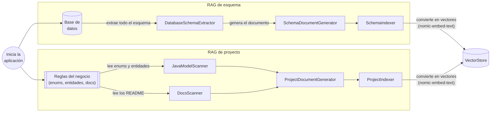
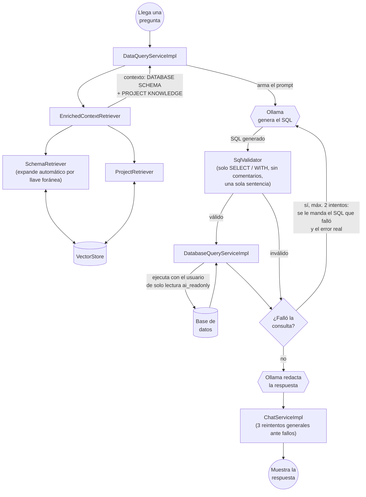
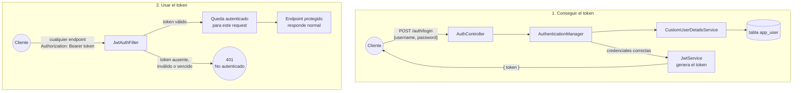

# Crud Java Santiago

CRUD de facturación (productos, facturas, pagos) con auditoría, autenticación
por JWT, y un asistente de negocio con IA que responde preguntas usando
RAG + Text-to-SQL, corriendo 100% en local con Ollama.

---

## 1. Arquitectura general

El proyecto tiene tres capas:

1. **Negocio**: productos (`/items`), facturas (`/invoices`) y pagos
   (`/payments`), con auditoría de cambios.
2. **Autenticación**: login con JWT — todos los endpoints de negocio y de
   IA exigen un token válido.
3. **Asistente de IA**: le preguntas en español y responde con datos reales,
   combinando RAG (busca contexto) + Text-to-SQL (genera y ejecuta la
   consulta).

Instalación detallada del asistente de IA (Ollama, modelos) en
[`INSTALACIONCHATBOT.md`](./INSTALACIONCHATBOT.md). Este documento se
enfoca en la arquitectura completa y el uso de la API.

---

## 2. El asistente de IA

### 2.1 Indexación (al arrancar la aplicación)

Cada vez que la app arranca, indexa desde cero dos fuentes de conocimiento
en un buscador semántico en memoria (`VectorStore`). No queda nada
guardado entre una corrida y otra.



### 2.2 Recuperación (cuando llega una pregunta)



**Piezas de seguridad en esta parte** (no se ven en el flujo, pero son las
que evitan que la IA pueda hacer daño):

- `SqlValidator` solo deja pasar `SELECT`/`WITH`, bloquea comentarios SQL y
  bloquea que se manden varias sentencias pegadas.
- La ejecución real (`DatabaseQueryServiceImpl`) usa un usuario de base de
  datos aparte, `ai_readonly`, que **solo tiene permiso de `SELECT`** —
  aunque el paso anterior fallara, la base de datos misma rechazaría
  cualquier intento de escribir.
- Límite de 100 filas de resultado y 5 segundos de espera por consulta.

---

## 3. Autenticación (JWT)

Todos los endpoints de negocio y de IA exigen un token. Hay que loguearse
primero para conseguirlo.



- Al arrancar la app, si no existe, se crea un usuario inicial:
  **usuario `admin`, contraseña `12345`** (guardada con hash BCrypt, nunca
  en texto plano).
- El token es JWT firmado (HS256), válido por 24 horas.
- No hay roles ni registro de usuarios nuevos — es "autenticado sí/no",
  a propósito, para mantenerlo simple.
- `/auth/login`, la consola de H2 y Swagger quedan libres de token (son
  para desarrollo, no son endpoints de negocio); todo lo demás lo exige.

**Archivos involucrados:**

| Archivo | Qué hace |
|---|---|
| `User.java` / `UserRepository.java` | El usuario y su tabla (`app_user`; se evita el nombre `user`, palabra reservada en H2). |
| `AdminUserInitializer.java` | Crea `admin`/`12345` al arrancar, si no existe. |
| `CustomUserDetailsService.java` | Le dice a Spring Security cómo buscar un usuario por nombre. |
| `JwtService.java` | Genera y valida el token. |
| `JwtAuthFilter.java` | Revisa el header `Authorization` en cada petición. |
| `SecurityConfig.java` | Define qué rutas son libres y cuáles piden token. |
| `AuthController.java` | El endpoint de login. |

---

## 4. Endpoints

Todos, salvo `/auth/login`, la consola H2 y Swagger, requieren el header:

```
Authorization: Bearer <token>
```

### Autenticación

| Método | Ruta | Body | Responde | Auth |
|---|---|---|---|---|
| `POST` | `/auth/login` | `{ "username": "admin", "password": "12345" }` | `{ "token": "..." }` | No |

### Productos (`/items`)

| Método | Ruta | Body | Responde |
|---|---|---|---|
| `POST` | `/items/saveitemS3` | `{ "nombre", "descripcion", "precio" }` | El producto creado: `{ "id", "nombre", "descripcion", "precioUnidad" }` |
| `GET` | `/items?page=0&size=10` | — | Página de productos activos (soft-delete excluidos) |
| `GET` | `/items/{id}` | — | El producto completo |
| `PUT` | `/items/{id}` | `{ "nombre", "descripcion", "precio" }` | El producto actualizado |
| `DELETE` | `/items/{id}` | — | Texto de confirmación (borrado lógico, no se elimina el registro) |

### Facturas (`/invoices`)

| Método | Ruta | Body | Responde |
|---|---|---|---|
| `POST` | `/invoices` | `{ "items": [{ "itemId": 1, "cantidad": 2 }] }` | La factura creada, en estado `PENDIENTE_DE_PAGO` |
| `GET` | `/invoices/{id}` | — | La factura completa: items, total, estado |
| `PUT` | `/invoices/{id}/items` | `{ "itemId": 1, "cantidad": 2 }` | La factura actualizada. Rechaza si la factura ya no está `PENDIENTE_DE_PAGO` (409) |

Estados posibles de una factura: `PENDIENTE_DE_PAGO`, `PAGO_PARCIAL`, `PAGADA`.

### Pagos (`/payments`)

| Método | Ruta | Body | Responde |
|---|---|---|---|
| `PUT` | `/payments/{invoiceId}` | `{ "monto": 500000, "metodoPago": "EFECTIVO" }` | El pago acumulado hasta ahora, con saldo pendiente o a favor si aplica. Se puede llamar varias veces para abonar de a poco |
| `GET` | `/payments/{invoiceId}` | — | El estado de pago actual de esa factura (404 si nunca se ha abonado nada) |

Métodos de pago válidos: `EFECTIVO`, `TARJETA`, `TRANSFERENCIA`, `PSE`.

### Asistente de IA (`/chat`)

| Método | Ruta | Body | Responde |
|---|---|---|---|
| `POST` | `/chat` | `{ "pregunta": "cuanto se ha pagado de la factura 3" }` | `{ "respuesta": "..." }`, en español, con datos reales |

Puede tardar entre 1 y 4 minutos por pregunta — corre 100% local, sin
tarjeta gráfica dedicada el modelo grande es lento. Ver
[`INSTALACIONCHATBOT.md`](./INSTALACIONCHATBOT.md) para más detalle.

### Utilidad

| Método | Ruta | Body | Responde |
|---|---|---|---|
| `GET` | `/ping` | — | Texto simple, para verificar que la app está viva |

---

## 5. Probar en local

```bash
mvn spring-boot:run
```

- **API / Swagger:** http://localhost:8080/doc/swagger-ui.html
- **Documentación OpenAPI (JSON):** http://localhost:8080/v3/api-docs
- **Consola H2:** http://localhost:8080/h2-console
  - JDBC URL: `jdbc:h2:mem:testdb`
  - Usuario: `sa` — contraseña: (vacía)
- **Login:** `POST http://localhost:8080/auth/login`

Ejemplo completo por consola:

```bash
# 1. Conseguir el token
TOKEN=$(curl -s -X POST http://localhost:8080/auth/login \
  -H "Content-Type: application/json" \
  -d '{"username":"admin","password":"12345"}' \
  | sed -n 's/.*"token":"\([^"]*\)".*/\1/p')

# 2. Usarlo en cualquier endpoint
curl http://localhost:8080/items \
  -H "Authorization: Bearer $TOKEN"
```
